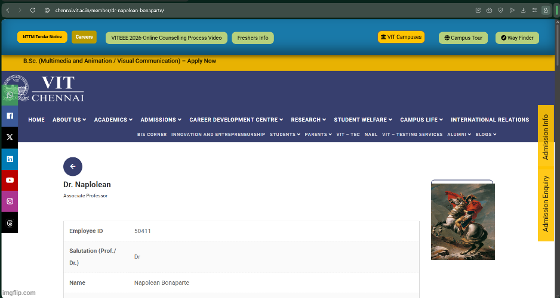
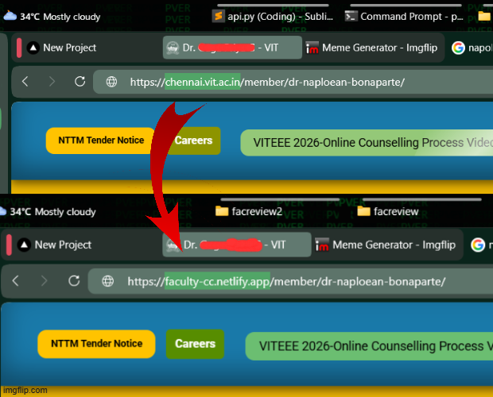
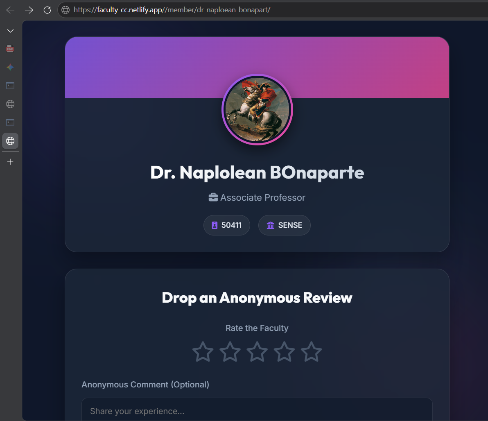

# FacultyCC

FacultyCC is a web application that adds a student-driven review system to VIT Chennai faculty profile pages.

## Overview

VIT Chennai provides faculty profile pages such as:

- https://chennai.vit.ac.in/member/dr-napolean-bonaparte/
- https://chennai.vit.ac.in/member/dr-albert-epstein/

FacultyCC mirrors the same URL structure while adding community reviews and ratings.

For example:

| Original Faculty Page | FacultyCC Page |
|----------------------|----------------|
| https://chennai.vit.ac.in/member/dr-napolean-bonaparte/ | https://faculty-cc.vercel.app/member/dr-napolean-bonaparte/ |
| https://chennai.vit.ac.in/member/dr-dr-albert-epstein/ | https://faculty-cc.netlify.app/member/dr-dr-albert-epstein/ |

As you know, there is facutly details page for every proffessor


Users can simply replace the domain name in the URL and instantly access ratings and reviews for the same faculty member.



## Features

- ⭐ Faculty ratings
- 📝 Student reviews
- 🔍 Search faculty by name
- 🔗 URL structure matching official VIT Chennai faculty pages
- ⚡ Fast and responsive interface
- 🌐 Hosted on Vercel and Netlify

## How It Works

1. Open a faculty profile on the official VIT Chennai website.

Example:

```text
https://chennai.vit.ac.in/member/dr-napolean-bonaparte-g/
```

2. Replace the domain with:

```text
https://faculty-cc.vercel.app
```

or

```text
https://faculty-cc.netlify.app
```

3. Keep the rest of the URL unchanged.

Result:

```text
https://faculty-cc.vercel.app/member/dr-napolean-bonaparte-g/
```

FacultyCC will automatically display the review page for that faculty member.

## Purpose

Selecting the right faculty can significantly impact a student's academic experience. FacultyCC aims to help students make informed decisions by providing a platform where they can share and read experiences about faculty members.



## Disclaimer

FacultyCC is an independent student project and is not affiliated with, endorsed by, or maintained by VIT Chennai.

Faculty information is sourced from publicly available faculty profile pages on the official VIT Chennai website. Reviews and ratings are submitted by users and do not necessarily represent the views of VIT Chennai.

## Tech Stack

- Frontend: [Your Frontend Framework]
- Backend: [Your Backend Framework]
- Database: [Your Database]
- Hosting: Vercel / Netlify

## License

This project is intended for educational and informational purposes.
